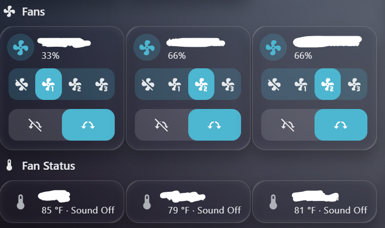

# NetPrisma Fan Dashboard

Local dashboard and REST API for OmniBreeze / Landbook tower fans using the stock Wi-Fi module. Docker-based, Home Assistant friendly, with automatic device discovery.

This project runs locally in Docker and provides:

- A local web dashboard
- REST API endpoints
- Landbook / NetPrisma email/password login
- Automatic UID detection
- Automatic family ID detection
- Automatic product key detection
- Power, speed, oscillation, and sound controls
- Temperature and device status display
- Basic-auth protection
## Screenshot of the Dashboard

## Important notes

This project is unofficial and is not affiliated with NetPrisma, Landbook, Quectel, or OmniBreeze.

Do not expose this dashboard directly to the internet. Run it on your LAN, VPN, or behind a trusted reverse proxy with proper authentication.

Do not commit your .env file.

## Requirements

- Docker
- Docker Compose
- A Landbook / NetPrisma account
- At least one supported fan already added in the official app

## Setup

Clone the repository:

    git clone https://github.com/YOUR_USERNAME/netprisma-fan-dashboard.git
    cd netprisma-fan-dashboard

Create your private environment file:

    cp .env.example .env
    nano .env

Example .env:

    DASHBOARD_USER=admin
    DASHBOARD_PASS=admin

    NETPRISMA_EMAIL=your-landbook-email@example.com
    NETPRISMA_PASSWORD=your-landbook-password

    NETPRISMA_USER_DOMAIN=U.SP.8589934603
    NETPRISMA_USER_DOMAIN_SECRET=pUTp5goB1bLinprRQMmK3EPiiuPiGrJtKUNptWRXVmP

    #NETPRISMA_UID=
    #NETPRISMA_FID=
    #NETPRISMA_PRODUCT_KEY=

Start the container:

    docker compose up -d --build

Open the dashboard:

    http://YOUR_SERVER_IP:8099

## API

Get current fan state:

    curl -u admin:admin http://YOUR_SERVER_IP:8099/api/state

Send a command:

    curl -u admin:admin\
      -H "Content-Type: application/json" \
      -d '{"device_key":"DEVICE_KEY","action":"on"}' \
      http://YOUR_SERVER_IP:8099/api/command

Supported actions:

- on
- off
- speed:1
- speed:2
- speed:3
- osc_on
- osc_off
- sound_on
- sound_off

Turn all fans on:

    curl -u admin:admin \
      -H "Content-Type: application/json" \
      -d '{"action":"on"}' \
      http://YOUR_SERVER_IP:8099/api/all

Turn all fans off:

    curl -u admin:admin \
      -H "Content-Type: application/json" \
      -d '{"action":"off"}' \
      http://YOUR_SERVER_IP:8099/api/all

## Home Assistant integration

This dashboard can be used as a small local bridge for Home Assistant. The container exposes REST endpoints that Home Assistant can poll and call without needing to reverse-engineer the fan inside Home Assistant itself.

Recommended setup:

- Run this container on the same LAN as Home Assistant.
- Keep the dashboard behind Basic Auth.
- Store the dashboard password in `secrets.yaml`.
- Use `/api/state` for fan status.
- Use `/api/command` for power, speed, oscillation, and sound commands.
- Use `/api/all` for all-fan on/off commands.

Example `secrets.yaml`:

    netprisma_dashboard_password: change-me

Example `configuration.yaml` REST command:

    rest_command:
      netprisma_fan_command:
        url: "http://YOUR_SERVER_IP:8099/api/command"
        method: POST
        username: "admin"
        password: !secret netprisma_dashboard_password
        authentication: basic
        headers:
          Content-Type: "application/json"
        payload: '{"device_key":"{{ device_key }}","action":"{{ action }}"}'

Example service call from Home Assistant:

    service: rest_command.netprisma_fan_command
    data:
      device_key: DEVICE_KEY
      action: "on"

Example actions:

- `on`
- `off`
- `speed:1`
- `speed:2`
- `speed:3`
- `osc_on`
- `osc_off`
- `sound_on`
- `sound_off`

Example all-fans REST command:

    rest_command:
      netprisma_all_fans:
        url: "http://YOUR_SERVER_IP:8099/api/all"
        method: POST
        username: "admin"
        password: !secret netprisma_dashboard_password
        authentication: basic
        headers:
          Content-Type: "application/json"
        payload: '{"action":"{{ action }}"}'

Example all-fans service call:

    service: rest_command.netprisma_all_fans
    data:
      action: "off"

For full Home Assistant fan entities, create template fans on top of these REST commands and the `/api/state` response. The API returns each fan by device key, including power, speed, temperature, oscillation, sound, online status, and product key.

## Home Assistant dashboard example

This is an example Home Assistant dashboard card using the fan entities, temperature sensors, and sound switches exposed through the REST/template integration.

The top row uses native Home Assistant tile cards for fan control. The second row uses Mushroom template cards to show temperature and sound status. Holding or double-tapping the status cards toggles the fan sound switch.

Example Lovelace card:

    type: vertical-stack
    cards:
      - type: heading
        heading: Fans
        icon: mdi:fan

      - type: grid
        columns: 3
        square: false
        cards:
          - type: tile
            entity: fan.sami_fan
            name: Sami Fan
            icon: mdi:fan
            vertical: false
            tap_action:
              action: toggle
            hold_action:
              action: more-info
            double_tap_action:
              action: more-info
            features:
              - type: fan-speed
              - type: fan-oscillate
            features_position: bottom

          - type: tile
            entity: fan.kitchen_fan
            name: Kitchen Fan
            icon: mdi:fan
            vertical: false
            tap_action:
              action: toggle
            hold_action:
              action: more-info
            double_tap_action:
              action: more-info
            features:
              - type: fan-speed
              - type: fan-oscillate
            features_position: bottom

          - type: tile
            entity: fan.bedroom_fan
            name: Bedroom Fan
            icon: mdi:fan
            vertical: false
            tap_action:
              action: toggle
            hold_action:
              action: more-info
            double_tap_action:
              action: more-info
            features:
              - type: fan-speed
              - type: fan-oscillate
            features_position: bottom

      - type: heading
        heading: Fan Status
        icon: mdi:thermometer

      - type: grid
        columns: 3
        square: false
        cards:
          - type: custom:mushroom-template-card
            entity: sensor.sami_fan_temperature
            primary: Sami
            secondary: >
              {{ states('sensor.sami_fan_temperature') }}
              {{ state_attr('sensor.sami_fan_temperature', 'unit_of_measurement') or '°F' }}
              · Sound {{ states('switch.sami_fan_sound') | title }}
            icon: mdi:thermometer
            icon_color: |
              
                amber
              
                disabled
              
            layout: horizontal
            multiline_secondary: false
            tap_action:
              action: more-info
            hold_action:
              action: call-service
              service: switch.toggle
              target:
                entity_id: switch.sami_fan_sound
            double_tap_action:
              action: call-service
              service: switch.toggle
              target:
                entity_id: switch.sami_fan_sound

          - type: custom:mushroom-template-card
            entity: sensor.kitchen_fan_temperature
            primary: Kitchen
            secondary: >
              {{ states('sensor.kitchen_fan_temperature') }}
              {{ state_attr('sensor.kitchen_fan_temperature', 'unit_of_measurement') or '°F' }}
              · Sound {{ states('switch.kitchen_fan_sound') | title }}
            icon: mdi:thermometer
            icon_color: |
              
                amber
              
                disabled
              
            layout: horizontal
            multiline_secondary: false
            tap_action:
              action: more-info
            hold_action:
              action: call-service
              service: switch.toggle
              target:
                entity_id: switch.kitchen_fan_sound
            double_tap_action:
              action: call-service
              service: switch.toggle
              target:
                entity_id: switch.kitchen_fan_sound

          - type: custom:mushroom-template-card
            entity: sensor.bedroom_fan_temperature
            primary: Bedroom
            secondary: >
              {{ states('sensor.bedroom_fan_temperature') }}
              {{ state_attr('sensor.bedroom_fan_temperature', 'unit_of_measurement') or '°F' }}
              · Sound {{ states('switch.bedroom_fan_sound') | title }}
            icon: mdi:thermometer
            icon_color: |
              
                amber
              
                disabled
              
            layout: horizontal
            multiline_secondary: false
            tap_action:
              action: more-info
            hold_action:
              action: call-service
              service: switch.toggle
              target:
                entity_id: switch.bedroom_fan_sound
            double_tap_action:
              action: call-service
              service: switch.toggle
              target:
                entity_id: switch.bedroom_fan_sound

Note: the status cards require the Mushroom Cards custom integration. The fan tiles use native Home Assistant tile cards.

## Security

Keep these private:

- .env
- your Landbook / NetPrisma email
- your Landbook / NetPrisma password
- Bearer tokens
- refresh tokens
- real device keys

## Disclaimer

Use at your own risk. This project depends on private/unofficial cloud API behavior that may change without notice.
