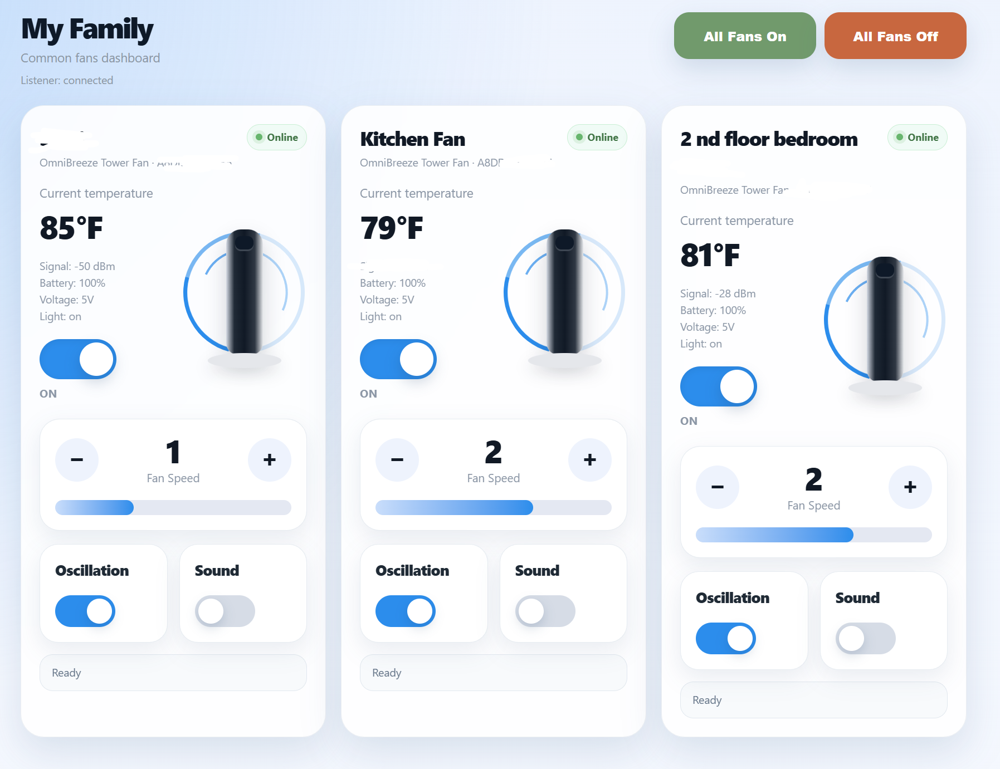

# NetPrisma Fan Dashboard

Local dashboard and REST API for OmniBreeze / Landbook tower fans using the stock Wi-Fi module. Docker-based, Home Assistant friendly, with automatic device discovery.

This project runs locally in Docker and provides:

- A local web dashboard
- REST API endpoints
- Landbook / NetPrisma email/password login
- Automatic UID detection
- Automatic family ID detection
- Automatic product key detection
- Power, speed, oscillation, and sound controls
- Temperature and device status display
- Basic-auth protection
## Screenshot of the Dashboard

## Important notes

This project is unofficial and is not affiliated with NetPrisma, Landbook, Quectel, or OmniBreeze.

Do not expose this dashboard directly to the internet. Run it on your LAN, VPN, or behind a trusted reverse proxy with proper authentication.

Do not commit your .env file.

## Requirements

- Docker
- Docker Compose
- A Landbook / NetPrisma account
- At least one supported fan already added in the official app

## Setup

Clone the repository:

    git clone https://github.com/YOUR_USERNAME/netprisma-fan-dashboard.git
    cd netprisma-fan-dashboard

Create your private environment file:

    cp .env.example .env
    nano .env

Example .env:

    DASHBOARD_USER=admin
    DASHBOARD_PASS=admin

    NETPRISMA_EMAIL=your-landbook-email@example.com
    NETPRISMA_PASSWORD=your-landbook-password

    NETPRISMA_USER_DOMAIN=U.SP.8589934603
    NETPRISMA_USER_DOMAIN_SECRET=pUTp5goB1bLinprRQMmK3EPiiuPiGrJtKUNptWRXVmP

    #NETPRISMA_UID=
    #NETPRISMA_FID=
    #NETPRISMA_PRODUCT_KEY=

Start the container:

    docker compose up -d --build

Open the dashboard:

    http://YOUR_SERVER_IP:8099

## API

Get current fan state:

    curl -u admin:admin http://YOUR_SERVER_IP:8099/api/state

Send a command:

    curl -u admin:admin\
      -H "Content-Type: application/json" \
      -d '{"device_key":"DEVICE_KEY","action":"on"}' \
      http://YOUR_SERVER_IP:8099/api/command

Supported actions:

- on
- off
- speed:1
- speed:2
- speed:3
- osc_on
- osc_off
- sound_on
- sound_off

Turn all fans on:

    curl -u admin:admin \
      -H "Content-Type: application/json" \
      -d '{"action":"on"}' \
      http://YOUR_SERVER_IP:8099/api/all

Turn all fans off:

    curl -u admin:admin \
      -H "Content-Type: application/json" \
      -d '{"action":"off"}' \
      http://YOUR_SERVER_IP:8099/api/all

## Home Assistant integration

The dashboard can also act as a small local bridge for Home Assistant.

The container talks to the Landbook / NetPrisma cloud API and exposes a local `/api/state` endpoint. Home Assistant can poll that endpoint, then use template entities to make the fans feel like normal Home Assistant fan entities.

The basic flow is:

1. `/api/state` gives Home Assistant the current state of each fan.
2. `rest_command.netprisma_fan_command` sends commands back to the dashboard.
3. Template fans turn those REST commands into normal `fan` entities.
4. Optional template sensors and switches expose temperature and sound state.

Replace these placeholders with your own values:

- `YOUR_SERVER_IP`
- `DEVICE_KEY_1`
- `DEVICE_KEY_2`
- `DEVICE_KEY_3`
- entity names like `omnibreeze_fan_1`, `omnibreeze_fan_2`, etc.

Do not publish your real device keys.

### Example Home Assistant configuration

Add this to `secrets.yaml`:

    netprisma_dashboard_password: change-me

Example `configuration.yaml`:

    rest:
      - resource: "http://YOUR_SERVER_IP:8099/api/state"
        scan_interval: 10
        authentication: basic
        username: "admin"
        password: !secret netprisma_dashboard_password
        sensor:
          - name: "OmniBreeze Fan 1 State"
            unique_id: omnibreeze_fan_1_state
            value_template: "{{ value_json.states.DEVICE_KEY_1.power }}"
            json_attributes_path: "$.states.DEVICE_KEY_1"
            json_attributes:
              - power
              - speed
              - temperature
              - oscillation
              - sound
              - online
              - productKey

          - name: "OmniBreeze Fan 2 State"
            unique_id: omnibreeze_fan_2_state
            value_template: "{{ value_json.states.DEVICE_KEY_2.power }}"
            json_attributes_path: "$.states.DEVICE_KEY_2"
            json_attributes:
              - power
              - speed
              - temperature
              - oscillation
              - sound
              - online
              - productKey

          - name: "OmniBreeze Fan 3 State"
            unique_id: omnibreeze_fan_3_state
            value_template: "{{ value_json.states.DEVICE_KEY_3.power }}"
            json_attributes_path: "$.states.DEVICE_KEY_3"
            json_attributes:
              - power
              - speed
              - temperature
              - oscillation
              - sound
              - online
              - productKey

    rest_command:
      netprisma_fan_command:
        url: "http://YOUR_SERVER_IP:8099/api/command"
        method: POST
        authentication: basic
        username: "admin"
        password: !secret netprisma_dashboard_password
        headers:
          Content-Type: "application/json"
        payload: '{"device_key":"{{ device_key }}","action":"{{ action }}"}'

      netprisma_all_fans:
        url: "http://YOUR_SERVER_IP:8099/api/all"
        method: POST
        authentication: basic
        username: "admin"
        password: !secret netprisma_dashboard_password
        headers:
          Content-Type: "application/json"
        payload: '{"action":"{{ action }}"}'

    template:
      - sensor:
          - name: "OmniBreeze Fan 1 Temperature"
            unique_id: omnibreeze_fan_1_temperature
            unit_of_measurement: "°F"
            state: "{{ state_attr('sensor.omnibreeze_fan_1_state', 'temperature') }}"

          - name: "OmniBreeze Fan 2 Temperature"
            unique_id: omnibreeze_fan_2_temperature
            unit_of_measurement: "°F"
            state: "{{ state_attr('sensor.omnibreeze_fan_2_state', 'temperature') }}"

          - name: "OmniBreeze Fan 3 Temperature"
            unique_id: omnibreeze_fan_3_temperature
            unit_of_measurement: "°F"
            state: "{{ state_attr('sensor.omnibreeze_fan_3_state', 'temperature') }}"

      - switch:
          - name: "OmniBreeze Fan 1 Sound"
            unique_id: omnibreeze_fan_1_sound
            state: "{{ state_attr('sensor.omnibreeze_fan_1_state', 'sound') == 'on' }}"
            turn_on:
              - service: rest_command.netprisma_fan_command
                data:
                  device_key: "DEVICE_KEY_1"
                  action: "sound_on"
            turn_off:
              - service: rest_command.netprisma_fan_command
                data:
                  device_key: "DEVICE_KEY_1"
                  action: "sound_off"

          - name: "OmniBreeze Fan 2 Sound"
            unique_id: omnibreeze_fan_2_sound
            state: "{{ state_attr('sensor.omnibreeze_fan_2_state', 'sound') == 'on' }}"
            turn_on:
              - service: rest_command.netprisma_fan_command
                data:
                  device_key: "DEVICE_KEY_2"
                  action: "sound_on"
            turn_off:
              - service: rest_command.netprisma_fan_command
                data:
                  device_key: "DEVICE_KEY_2"
                  action: "sound_off"

          - name: "OmniBreeze Fan 3 Sound"
            unique_id: omnibreeze_fan_3_sound
            state: "{{ state_attr('sensor.omnibreeze_fan_3_state', 'sound') == 'on' }}"
            turn_on:
              - service: rest_command.netprisma_fan_command
                data:
                  device_key: "DEVICE_KEY_3"
                  action: "sound_on"
            turn_off:
              - service: rest_command.netprisma_fan_command
                data:
                  device_key: "DEVICE_KEY_3"
                  action: "sound_off"

The example above shows the bridge pattern. Repeat the same idea for each fan you want to expose in Home Assistant.

### Example Lovelace card

This example uses obfuscated entity names. Change the entity IDs to match your Home Assistant entities.

    type: vertical-stack
    cards:
      - type: heading
        heading: Fans
        icon: mdi:fan

      - type: grid
        columns: 3
        square: false
        cards:
          - type: tile
            entity: fan.omnibreeze_fan_1
            name: Fan 1
            icon: mdi:fan
            vertical: false
            tap_action:
              action: toggle
            hold_action:
              action: more-info
            double_tap_action:
              action: more-info
            features:
              - type: fan-speed
              - type: fan-oscillate
            features_position: bottom

          - type: tile
            entity: fan.omnibreeze_fan_2
            name: Fan 2
            icon: mdi:fan
            vertical: false
            tap_action:
              action: toggle
            hold_action:
              action: more-info
            double_tap_action:
              action: more-info
            features:
              - type: fan-speed
              - type: fan-oscillate
            features_position: bottom

          - type: tile
            entity: fan.omnibreeze_fan_3
            name: Fan 3
            icon: mdi:fan
            vertical: false
            tap_action:
              action: toggle
            hold_action:
              action: more-info
            double_tap_action:
              action: more-info
            features:
              - type: fan-speed
              - type: fan-oscillate
            features_position: bottom

The fan tiles above use native Home Assistant tile cards. If you also want the temperature/sound row shown in the screenshot, add Mushroom Cards and create template cards using your temperature sensors and sound switches.

## Security

Keep these private:

- .env
- your Landbook / NetPrisma email
- your Landbook / NetPrisma password
- Bearer tokens
- refresh tokens
- real device keys

## Disclaimer

Use at your own risk. This project depends on private/unofficial cloud API behavior that may change without notice.
